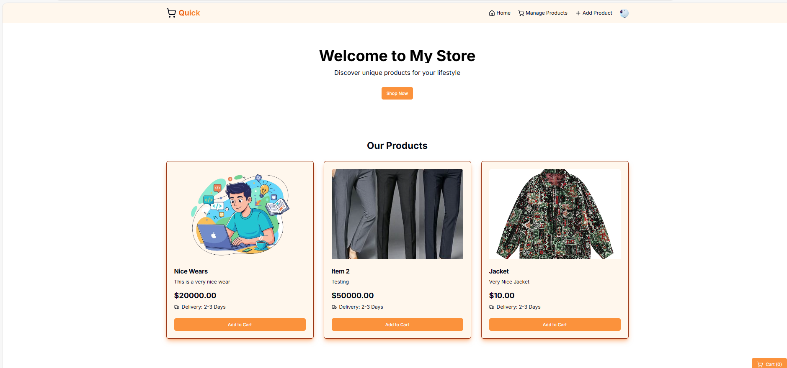

# 🛒 Modern E-commerce App (Next.js + Convex + Clerk + Stripe)

A fast, modern, full-stack e-commerce solution built with:

-   **Next.js 14 (App Router)**
-   **Convex** as a real-time backend
-   **Clerk** for authentication & RBAC
-   **Stripe** for payments
-   **UploadThing** for media uploads

Designed for learning, production use, and long-term maintainability.

------------------------------------------------------------------------

## 🖼️ Preview



> Replace this preview image later with your own screenshot for better
> branding.

------------------------------------------------------------------------

## 📦 Tech Stack Overview

### **Frontend**

-   Next.js 14 (App Router)
-   React Server Components + Server Actions
-   TailwindCSS

### **Backend**

-   Convex (Database + Functions)
-   Stripe Webhooks
-   Clerk Authentication & Metadata roles (Admin, Moderator)

### **Integrations**

-   UploadThing (image uploads)
-   RBAC via Clerk + Middleware
-   Secure checkout via Stripe

------------------------------------------------------------------------

## 📁 Project Structure

    .
    ├── .next/
    ├── app/
    ├── components/
    ├── convex/
    ├── lib/
    ├── providers/
    ├── public/
    ├── types/
    ├── .env.local
    ├── .eslintrc.json
    ├── .gitignore
    ├── components.json
    ├── LICENSE
    ├── middleware.ts
    ├── next-env.d.ts
    ├── next.config.mjs
    ├── package.json
    ├── package-lock.json
    ├── postcss.config.mjs
    ├── README.md
    ├── tailwind.config.ts
    └── tsconfig.json

------------------------------------------------------------------------

## 🛠️ Getting Started

### **1. Install Dependencies**

``` sh
npm install
```

### **2. Create `.env.local`**

``` env
# Deployment used by `npx convex dev`
CONVEX_DEPLOYMENT=

NEXT_PUBLIC_CONVEX_URL=

NEXT_PUBLIC_CLERK_PUBLISHABLE_KEY=
CLERK_SECRET_KEY=

UPLOADTHING_SECRET=
UPLOADTHING_APP_ID=

STRIPE_SECRET_KEY=

NEXT_PUBLIC_BASE_URL=
```

### ⚠️ Important

When you run:

``` sh
npx convex dev
```

Convex will generate:

    CONVEX_DEPLOYMENT=
    NEXT_PUBLIC_CONVEX_URL=

Paste them back into `.env.local`.

------------------------------------------------------------------------

## 🔐 Authentication (Clerk)

Clerk handles:

-   Sign-in / Sign-up\
-   User sessions\
-   Role-Based Access Control (RBAC)

### **Roles stored in `publicMetadata`:**

``` json
{
  "role": "admin"
}
```

Supported roles: - `admin` (full access) - `moderator` (partial
access) - `user` (default shopper)

------------------------------------------------------------------------

## 📤 Image Upload (UploadThing)

Used for:

-   Product images\
-   Category banners

Set up in UploadThing dashboard:

    UPLOADTHING_APP_ID=
    UPLOADTHING_SECRET=

------------------------------------------------------------------------

## 💳 Payments (Stripe)

Stripe Checkout integration includes:

-   Creating checkout sessions\
-   Verifying payment status\
-   Webhook listener at:\

```{=html}
<!-- -->
```
    /api/webhooks/stripe

Events: - `checkout.session.completed` - `payment_intent.succeeded`

------------------------------------------------------------------------

## 🏗️ Development

Start the dev server:

``` sh
npm run dev
```

Open the app:\
👉 http://localhost:3000

------------------------------------------------------------------------

## 🚀 Deployment

### **Vercel**

1.  Upload repo\
2.  Add all environment variables\
3.  Connect Convex production deployment\
4.  Add Stripe webhook for production:

```{=html}
<!-- -->
```
    https://your-domain.com/api/webhooks/stripe

------------------------------------------------------------------------

## 🤝 Contributing

Pull requests are welcome!

------------------------------------------------------------------------

## 📜 License

MIT License
